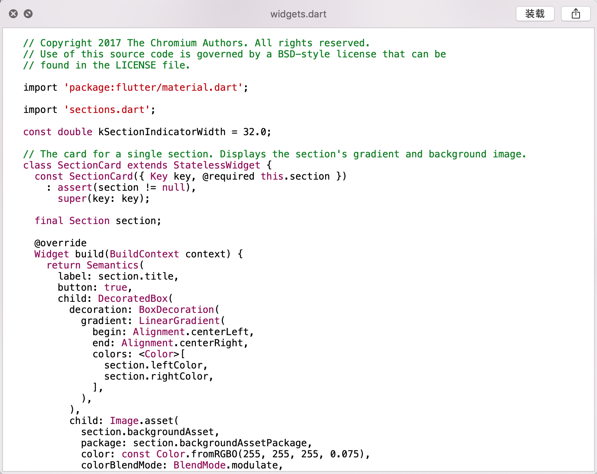

# 安装包下载
[ProvisionDart.qlgenerator](https://raw.githubusercontent.com/skeyboy/ProvisionDart/master/resource/ProvisionDart.qlgenerator)

[一键下载dmg安装包](https://raw.githubusercontent.com/skeyboy/ProvisionDart/master/dmg/Dart.dmg)

# 安装

1 拖拽 ```ProvisionDart.qlgenerator```至```QuickLook的替身```

2 打开Terminal输入```qlmanage -r```


# 使用ProvisionDart.qlgenerator安装

1 将ProvisionDart.qlgenerator放置与 /Libaray/QuickLook/下

2 打开Terminal输入```qlmanage -r```


# 预览




